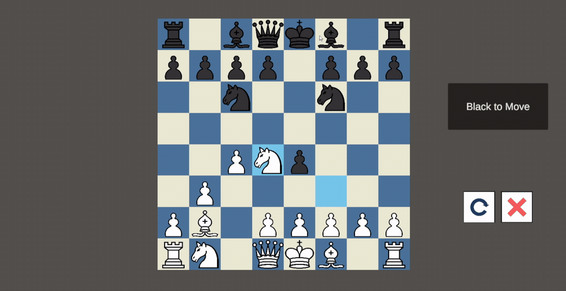

# Chessboard

Unity로 제작한 로컬 2인용 체스 게임입니다. 기물 선택과 이동부터 특수 행마,
체크메이트와 무승부까지 핵심 체스 규칙을 직접 구현했습니다.

## 플레이 데모

**기본 이동부터 특수 행마, 무승부 판정까지 — 직접 구현한 체스 규칙을 실제 플레이로 확인해 보세요.**

[▶ 전체 영상 보기 · 1분 50초](https://blackmint-chong.github.io/Chessboard-Portfolio/media/chessboard-demo.mp4) · [♟ Web에서 직접 플레이](https://blackmint-chong.github.io/Chessboard-Portfolio/)

전체 영상에서는 다음 기능을 시연합니다. 위 미리보기는 일부 구간을 1.5배속으로 보여줍니다.

- **기본 플레이**: 기물 이동·포획, 체크
- **특수 행마**: 캐슬링, 앙파상, 프로모션
- **게임 진행**: 수 되돌리기, 게임 초기화, 삼수동형(3회 동형 반복) 무승부 판정

## 빠른 실행

1. Unity Hub에서 이 저장소의 루트 폴더를 추가하고 Unity `6000.3.9f1`로 엽니다.
2. 첫 가져오기가 끝나면 빈 씬 대신 `GameScene`이 자동으로 열립니다.
3. 상단 **Play**를 누르면 게임을 확인할 수 있습니다.

시작 씬을 직접 열려면 **Portfolio > Open Startup Scene** 메뉴를 사용하거나,
Project 창에서 `Assets/Scenes/GameScene.unity`를 더블클릭합니다.
이미 열어 둔 씬이나 저장하지 않은 변경이 있으면 자동 전환하지 않습니다.

## 프로젝트 정보

| 항목      | 내용                              |
| --------- | --------------------------------- |
| 개발 기간 | 2026.02. ~ 2026.05.           |
| 개발 인원 | 1명 (개인 프로젝트)               |
| 담당 범위 | 설계, 구현, 테스트 및 문서화 전반 |
| 활용 도구 | AI 코딩 에이전트                  |

## 조작법

| 동작        | 조작                  |
| ----------- | --------------------- |
| 기물 선택   | 마우스 왼쪽 버튼      |
| 기물 이동   | 이동할 칸을 왼쪽 클릭 |
| 프로모션    | 승격할 기물 버튼 선택 |
| 수 되돌리기 | Undo 버튼             |
| 게임 초기화 | Reset 버튼            |

## Portfolio 범위

- 한 화면에서 번갈아 진행하는 로컬 2인 대전
- 턴과 체크 상태를 반영한 합법 수 생성 및 이동 제한
- 캐슬링, 앙파상, 프로모션 구현
- 체크, 체크메이트, 스테일메이트 판정
- 3회 동형 반복, 50수 규칙, 기물 부족 무승부 판정
- 현재 게임 상태 표시
- 수 되돌리기와 게임 초기화 확인 UI
- 핵심 체스 규칙에 대한 EditMode 테스트
- 대전 AI와 네트워크 플레이는 포함하지 않습니다.

## 설계 특징

- **게임 엔진과 화면 로직 분리**: 보드 상태와 체스 규칙을 담당하는 `Engine`과
  입력 및 화면 갱신을 담당하는 `UI`를 분리해 규칙을 독립적으로 검증할 수 있게
  구성했습니다.
- **기물별 이동 전략**: 공통 이동 인터페이스를 기준으로 킹, 퀸, 룩, 비숍,
  나이트, 폰의 이동 규칙을 각각 분리했습니다.
- **상태 이력 기반 게임 진행**: 수를 적용할 때 보드 상태와 이동 기록을 보관하여
  되돌리기와 3회 동형 반복 판정이 같은 이력을 사용하도록 구성했습니다.
- **FEN 기반 보드 구성**: 원하는 체스 상황을 FEN으로 생성할 수 있어 복잡한
  체크메이트, 무승부, 특수 행마 조건을 짧고 반복 가능한 테스트로 검증합니다.
- **종료 사유의 명시적 관리**: 체크메이트와 각 무승부 사유를 게임 로직에서
  판정하고 UI가 해당 결과를 구체적인 텍스트로 표시하도록 했습니다.
- **자동화된 검증**: 런타임 코드와 테스트 어셈블리를 분리하고, 보드 생성부터
  합법 수, 특수 행마, 게임 종료까지 확인하는 EditMode 테스트 34개를 구성했습니다.

## 실행 환경

- Unity `6000.3.9f1`
- Universal Render Pipeline `17.3.0`
- Unity UI / TextMeshPro `2.0.0`
- Unity Test Framework `1.6.0`

`Assets/Scenes/GameScene.unity`에서 Play하면 게임을 확인할 수 있습니다.
빌드에도 `GameScene` 한 개만 포함되어 있습니다.

## 빌드

Unity의 `File > Build Profiles`에서 대상 플랫폼을 선택해 빌드할 수 있습니다.
현재 `docs` 폴더에는 GitHub Pages 배포용 WebGL 빌드가 포함되어 있습니다.
웹 플레이 화면은 16:9 비율을 유지하며 브라우저 창 안에 맞춰지고, 창 크기를 바꾸면
자동으로 조정됩니다. `docs/index.html`과 `docs/TemplateData/style.css`에 이 배치를
적용했으므로 WebGL을 다시 빌드할 때는 해당 페이지 설정을 유지해야 합니다.

## 테스트

Unity Test Runner의 EditMode 탭에서 `Tests` 어셈블리를 실행합니다. 테스트는 다음
범위를 검증합니다.

- FEN 기반 보드 상태 생성
- 기물별 이동 및 합법 수 생성
- 캐슬링, 앙파상, 프로모션 적용
- 체크메이트와 네 가지 무승부 조건
- 잘못된 이동 거부와 게임 상태 보존

## 상세 문서

설계 과정과 주요 문제 해결 내용은 별도의 포트폴리오 PDF로 제공합니다.
